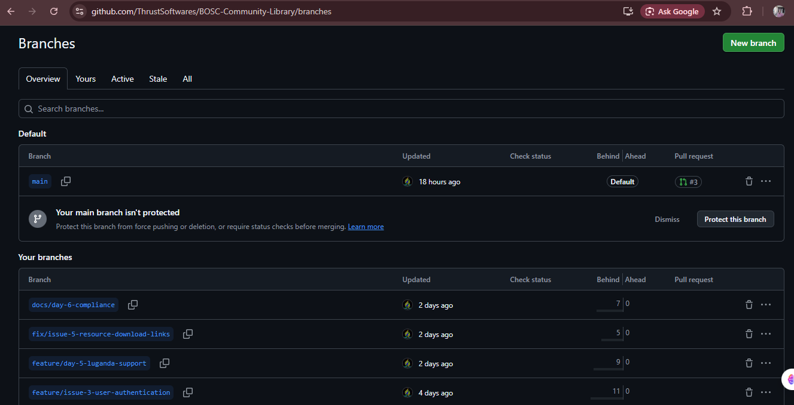
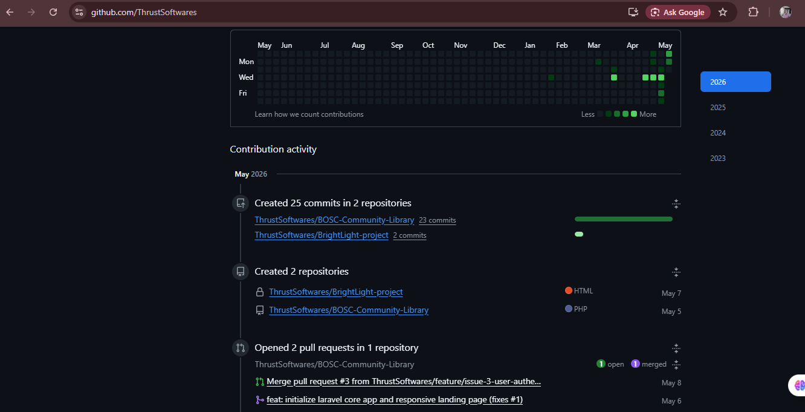
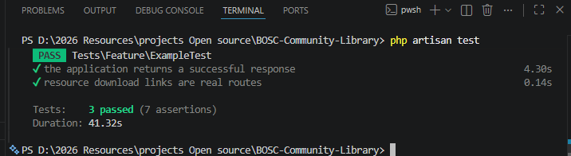
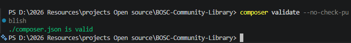
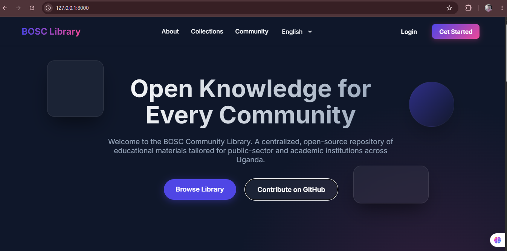
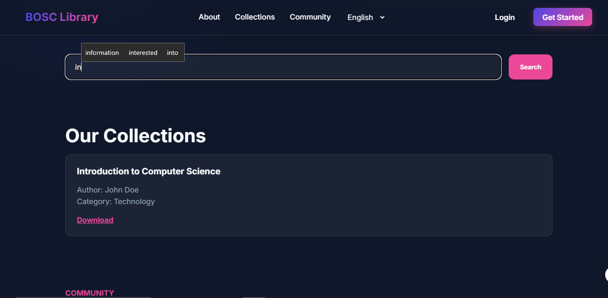
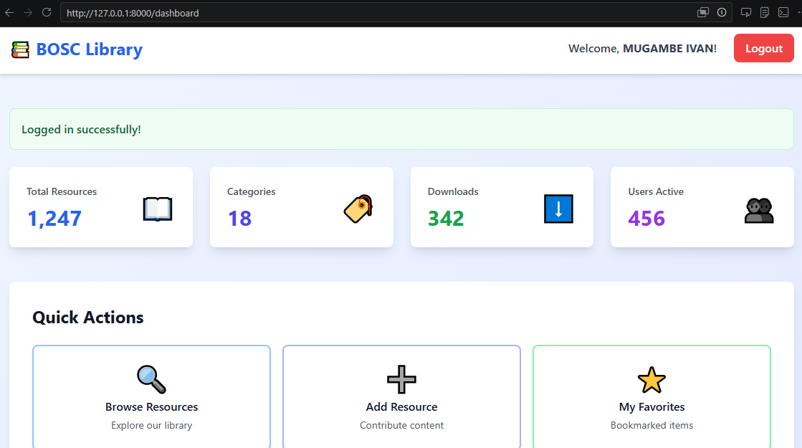

# Submission Log

**Project:** BOSC Community Library  
**Student Name:** MUGAMBE IVAN  
**Registration Number:** 22/BSE/BU/R/1007  
**Repository:** https://github.com/ThrustSoftwares/BOSC-Community-Library  
**Submission Folder:** https://drive.google.com/drive/folders/11K2x-afyUcmtl5vQoQcWGGjDxrD-hkBP?usp=drive_link  
**Course:** BSCT 3221 - Open Source Software  
**Submission Date:** 12 May 2026

## Examiner Guide

This repository includes the project source code, documentation, governance files, legal and sustainability analysis, and screenshot evidence for the open source software coursework submission. The screenshots are stored in the repository folder named `Sreenshots/` so the examiner can verify the GitHub activity, issue tracking, pull requests, testing commands, and working application features alongside the GitHub repository link above.

## Repository Evidence

| Requirement | Evidence |
| --- | --- |
| Public GitHub repository | `BOSC-Community-Library` on GitHub |
| Open source license | `LICENSE` and GPLv3 metadata in `composer.json` |
| Community standards | `CODE_OF_CONDUCT.md` |
| Contributor guidance | `CONTRIBUTING.md` |
| Issue and PR templates | `.github/ISSUE_TEMPLATE` and `.github/PULL_REQUEST_TEMPLATE.md` |
| Legal analysis | `LEGAL_ANALYSIS.md` |
| Sustainability model | `SUSTAINABILITY.md` |
| Government proposal | `GOVERNMENT_PROPOSAL.md` |
| Governance reflection | `GOVERNANCE_REFLECTION.md` |
| Final project audit | `DAY7_PROJECT_AUDIT.md` |

## GitHub Activity Evidence

The screenshots below show consistent GitHub activity across the project period, including commits made on different days, repository branches, and the GitHub profile contribution graph.

### Commit Activity


**Description:** Commit history showing early project setup and development work completed during Day 1 and Day 2.


**Description:** Commit history showing continued implementation, documentation, and project improvements during Day 3, Day 4, and Day 5.


**Description:** Commit history showing final project refinements, testing, documentation updates, and submission preparation during Day 6 and Day 7.

### Branch Activity



**Description:** GitHub branches used during development, showing that project work was organized through separate branches before being merged.

### GitHub Profile Contributions



**Description:** GitHub profile contribution graph showing project activity during the coursework period.

## Issue and Pull Request Evidence

The screenshots below show closed issues and merged pull requests. They demonstrate that project tasks were tracked using GitHub Issues and completed through pull requests before being merged into the repository.

### Resolved Issues


**Description:** Closed GitHub issue showing one of the completed project tasks and its resolution status.


**Description:** Closed GitHub issue showing another resolved project task, confirming issue tracking was used up to the final fixes.

### Merged Pull Requests


**Description:** GitHub pull requests page showing merged pull requests used to integrate completed project work.


**Description:** Detailed merged pull request evidence showing the PR status and the completed review and merge workflow.

## Verification and Runtime Evidence

The following screenshots show that the project was tested, validated, and run successfully in the local development environment.

### Test Results



**Description:** Terminal output showing the Laravel test suite running successfully with `php artisan test`.

### Composer Validation



**Description:** Terminal output showing Composer validation working successfully for the project setup.

## Application Feature Evidence

The screenshots below show the working BOSC Community Library application and its main features.

### Homepage



**Description:** Running homepage showing the public library interface and the main project presentation.

### Search Functionality



**Description:** Search functionality showing that library resources can be filtered and found through the application interface.

### Luganda Language Support


**Description:** Library interface displayed in Luganda, showing multilingual support for local community users.

### Authenticated User Dashboard



**Description:** Dashboard shown after user authentication, confirming that the login-protected user area is working.

## Final Verification Commands

The project was checked using the following commands:

```bash
php artisan test
composer validate --no-check-publish
git status --short --branch
```

## Submission Checklist

- [x] GitHub repository link added to the Google Drive submission.
- [x] `SUBMISSION_LOG.md` prepared as an examiner guide.
- [x] `GOVERNANCE_REFLECTION.md` committed for governance reflection evidence.
- [x] GitHub issues were created and closed.
- [x] Pull requests were merged.
- [x] GitHub activity screenshots were saved in `Sreenshots/`.
- [x] Resolved issue and pull request screenshots were saved in `Sreenshots/`.
- [x] GitHub profile contribution graph screenshot was saved in `Sreenshots/`.
- [x] Test and validation screenshots were saved in `Sreenshots/`.
- [x] Application feature screenshots were saved in `Sreenshots/`.
- [x] Final repository evidence is available through the GitHub repository link.
